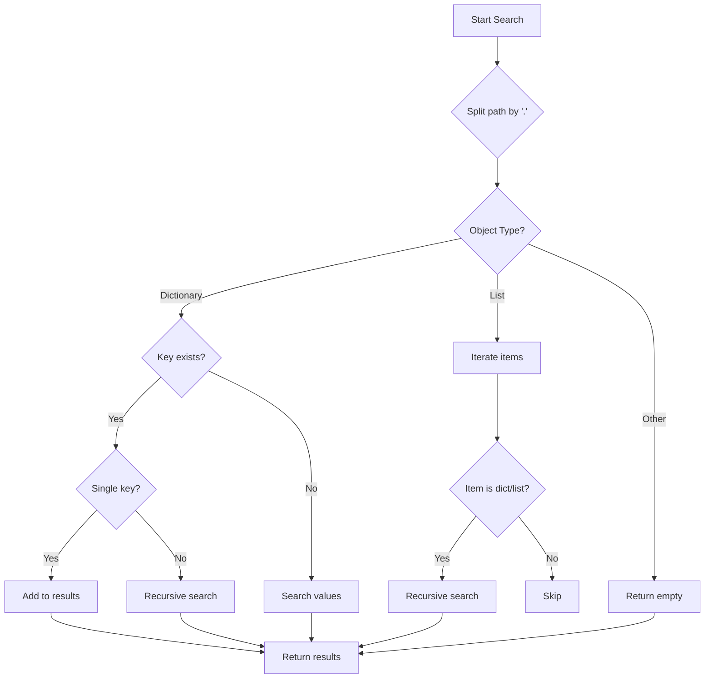

# JSON Parser - GUI Application

<div align="center">


**A simple graphical application for parsing JSON data from web sources**

</div>

## 📖 Table of Contents

- [Overview](#overview)
- [Features](#features)
- [Installation](#installation)
- [Usage](#usage)
- [Code Explanation](#code-explanation)
- [Examples](#examples)
- [Error Handling](#error-handling)

## 🎯 Overview

JSON Parser is a user-friendly desktop application that allows you to:
- Fetch JSON data from any public API or web source
- Search for specific attributes within complex JSON structures
- Display results in a clean, scrollable interface

## ✨ Features

| Feature | Description |
|---------|-------------|
| 🔗 **URL Support** | Fetch JSON from any HTTP/HTTPS endpoint |
| 🔍 **Deep Search** | Recursive search through nested JSON structures |
| 📋 **Multiple Attributes** | Search for multiple attributes at once |
| 🎨 **Simple GUI** | Easy-to-use Tkinter interface |
| ⚡ **Quick Results** | Fast parsing and display |
| 🛡 **Error Handling** | Comprehensive error messages |

## 🚀 Installation

### Prerequisites
- Python 3.6 or higher
- Internet connection (for fetching JSON data)

### Required Libraries
```bash
pip install requests
```

### Running the Application
```bash
python json_parser.py
```

## 📱 Usage

### Step-by-Step Guide

1. **Enter JSON URL**
   - Paste the URL containing JSON data
   - Example: `https://api.example.com/data`

2. **Specify Attributes**
   - Enter attributes separated by commas
   - Support for nested paths using dots
   - Examples:
     - Simple: `name, email, phone`
     - Nested: `user.profile.name, address.city`

3. **Parse Data**
   - Click the "Parse" button
   - View results in the output area

4. **Quick Test**
   - Use the "Example" button to load test data

### Interface Overview

```
┌─────────────────────────────────────────────────┐
│            JSON Parser - GUI Application        │
├─────────────────────────────────────────────────┤
│ URL with JSON data:                             │
│ [https://api.example.com/data             ]     │
│                                                 │
│ Attributes (comma separated):                   │
│ [name, email, address.city                ]     │
│                                                 │
│             [ Parse ]  [ Example ]              │
│                                                 │
│ ┌─────────────────────────────────────────────┐ │
│ │ Results:                                    │ │
│ │ ========================================    │ │
│ │ Attribute: name                             │ │
│ │   ✓ John Doe                                │ │
│ │   ✓ Jane Smith                              │ │
│ │                                             │ │
│ │ Attribute: email                            │ │
│ │   ✓ john@example.com                        │ │
│ │   ✓ jane@example.com                        │ │
│ │                                             │ │
│ │ Attribute: address.city                     │ │
│ │   ✓ New York                                │ │
│ │   ✓ Los Angeles                             │ │
│ └─────────────────────────────────────────────┘ │
└─────────────────────────────────────────────────┘
```

## 🔧 Code Explanation

### Main Components

#### 1. Core Parsing Function
```python
def parse_json():
    # Clear previous results
    output_text.delete(1.0, tk.END)
    
    # Get user input
    url = input_link.get()
    attributes = input_attribute.get()
    
    # Input validation
    if not url or not attributes:
        output_text.insert(tk.END, "Please fill all fields!\n")
        return
```

#### 2. Recursive Search Algorithm
```python
def search_in_json(obj, path):
    results = []
    keys = path.split('.')  # Split path into components
    
    if isinstance(obj, dict):
        # Case 1: Current object is a dictionary
        if keys[0] in obj:
            if len(keys) == 1:
                # Final key - add value to results
                results.append(obj[keys[0]])
            else:
                # Nested keys - recursive search
                nested_path = '.'.join(keys[1:])
                nested_results = search_in_json(obj[keys[0]], nested_path)
                results.extend(nested_results)
        
        # Search in all dictionary values
        for value in obj.values():
            if isinstance(value, (dict, list)):
                results.extend(search_in_json(value, path))
                
    elif isinstance(obj, list):
        # Case 2: Current object is a list
        for item in obj:
            if isinstance(item, (dict, list)):
                results.extend(search_in_json(item, path))
    
    return results
```

### Search Algorithm Flowchart



## 📊 Examples

### Example 1: Simple JSON Structure

**Input URL:** `https://jsonplaceholder.typicode.com/users/1`

**JSON Response:**
```json
{
    "id": 1,
    "name": "Leanne Graham",
    "email": "Sincere@april.biz",
    "address": {
        "street": "Kulas Light",
        "city": "Gwenborough"
    }
}
```

**Attributes to Search:** `name, email, address.city`

**Output:**
```
Results:
========================================

Attribute: name
  ✓ Leanne Graham

Attribute: email
  ✓ Sincere@april.biz

Attribute: address.city
  ✓ Gwenborough
```

### Example 2: Complex Nested Structure

**Input URL:** `https://api.example.com/complex-data`

**JSON Response:**
```json
{
    "users": [
        {
            "profile": {
                "personal": {
                    "name": "John Doe",
                    "contacts": {
                        "email": "john@example.com",
                        "phone": "+1234567890"
                    }
                }
            }
        }
    ]
}
```

**Attributes to Search:** `profile.personal.name, profile.personal.contacts.email`

**Output:**
```
Results:
========================================

Attribute: profile.personal.name
  ✓ John Doe

Attribute: profile.personal.contacts.email
  ✓ john@example.com
```

## ⚠️ Error Handling

The application handles various error scenarios:

| Error Type | Handling |
|------------|----------|
| **Network Issues** | Shows connection error messages |
| **Invalid JSON** | Displays parsing errors |
| **Empty Fields** | Prompts user to fill required fields |
| **Missing Attributes** | Shows "Not found" for missing data |
| **Invalid URL** | Displays request exceptions |

### Common Error Messages
- `"Please fill all fields!"` - Missing URL or attributes
- `"Error: [details]"` - Network or parsing errors
- `"✗ Not found"` - Attribute doesn't exist in JSON

## 🎨 Customization

### Modifying Display Limits
Change the number of displayed results:
```python
# Current: Show first 5 values
for val in values[:5]:
    output_text.insert(tk.END, f"  ✓ {val}\n")

# Modified: Show first 10 values
for val in values[:10]:
    output_text.insert(tk.END, f"  ✓ {val}\n")
```

### Adding New Features
The modular code structure makes it easy to add:
- Export functionality
- Additional search filters
- Result sorting
- Theme customization

## 🤝 Contributing

Feel free to:
- Report bugs
- Suggest new features
- Submit pull requests
- Improve documentation

## 📄 License

This project is open source and available under the [MIT License](LICENSE).

---

<div align="center">

**Happy Parsing! 🚀**

</div>
